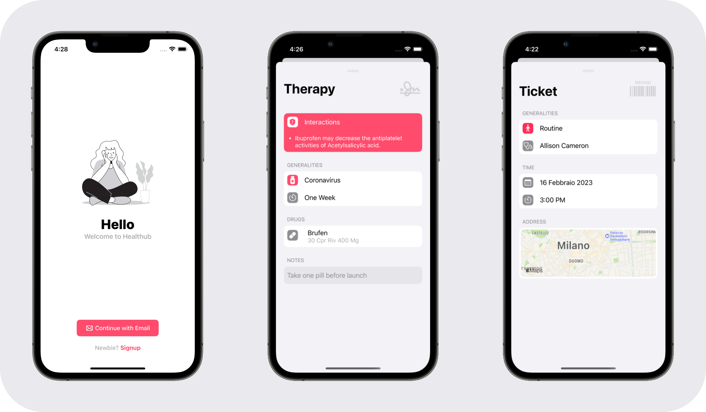
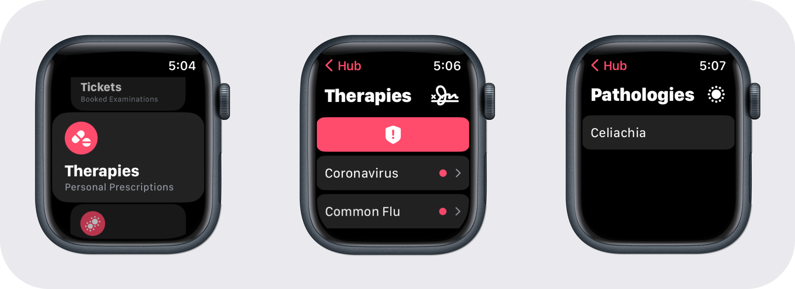

  

 

| Author 👨🏼‍💻 | GitHub 👾 | Email 📨 | Contribute 📐 | Language 🐤 |
| :--- | :--- | :--- | :--- | :--- |
| Dario Crippa | [AstroWLAN](https://github.com/AstroWLAN) | dario2.crippa@mail.polimit.it | UI and UX | Swift |
| Giovanni Dispoto | [giovannidispoto](https://github.com/giovannidispoto) | giovanni.dispoto@polimi.it | Backend | Swift + Python |

 

## Abstract 💭
Healthub is an iOS application that offers some useful health-related functions such as managing therapies or booking appointments for medical examinations.
Its main feature is the ability to **detect drug interactions** contained in therapies
> Healthub is a school project for the Design and Implementation of Mobile Applications course A.Y. 2022/2023 @Polimi  
It should not be used seriously in real life!

 

 

## WatchOS ⏱️
Healthub also offers a **companion app** for watchOS designed to quickly display the information contained in the main app
> It is not intended to input data from the watch

 

 

## Functionalities 🤖
The main functionalities offered by Healthub are the following ones

| Name ⚙️ | Description ✏️ |
| :--- | :--- |
| Tickets | The application allows users to book and manage medical appointments with doctors registered with the service.   Thanks to `MapKit` directions to reach the doctor's office are also provided |
| Therapies | A user can enter his own therapies by selecting medications from the database we've built.   If there's a potentially dangerous interaction with other drugs from other therapies Healthub will display an in-app warning |
| Contacts | A user can save the contact information of their own doctors |

## Backend 🧠
The backend source code is available in a separate repository [here](https://github.com/giovannidispoto/Healthub-backend) 

