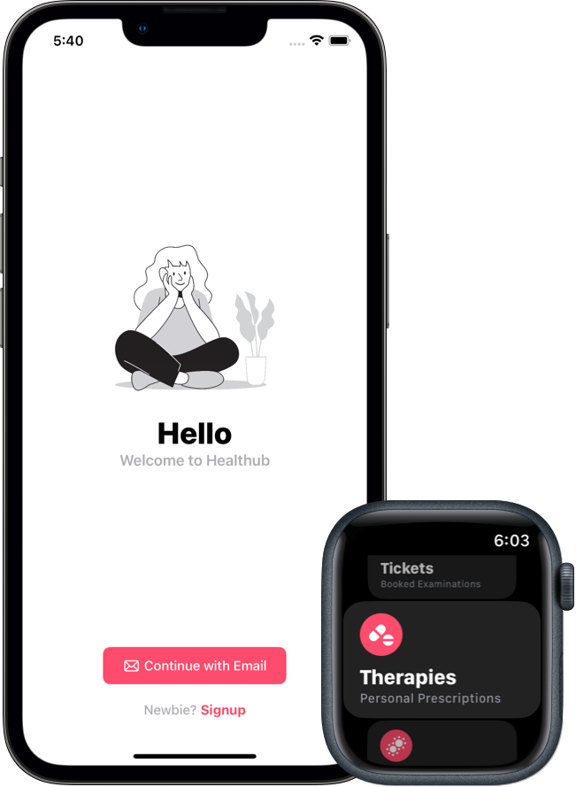
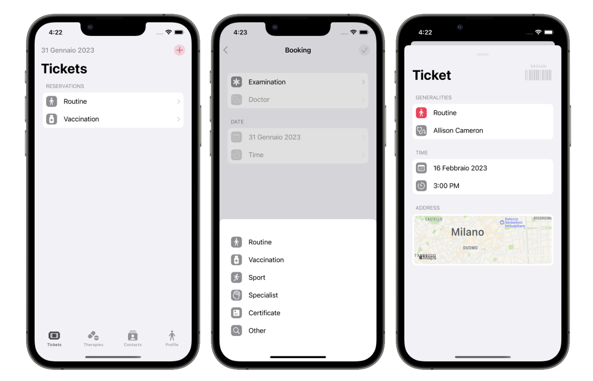
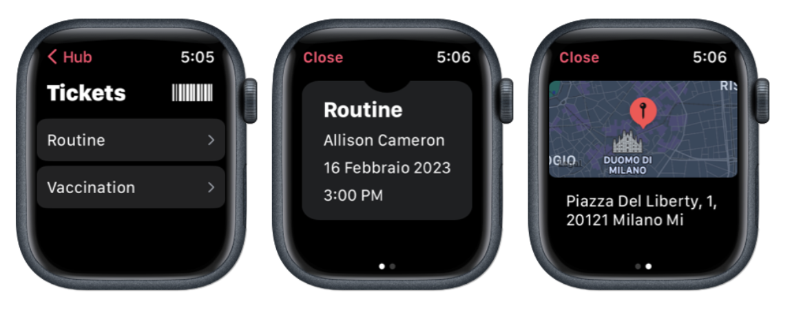
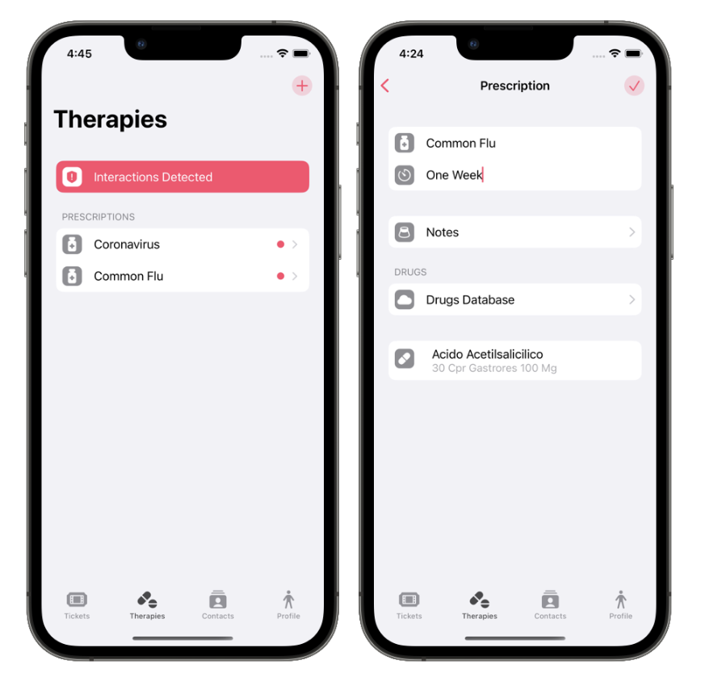
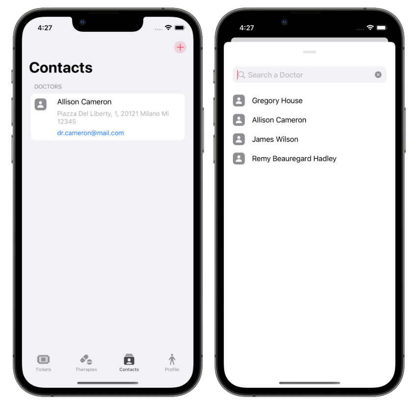
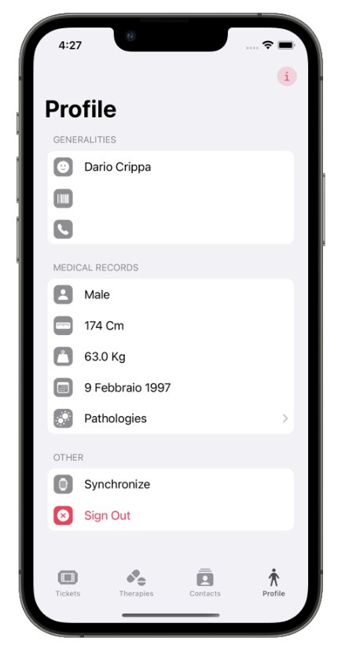

<!-- Improved compatibility of back to top link: See: https://github.com/othneildrew/Best-README-Template/pull/73 -->

<!--
*** Thanks for checking out the Best-README-Template. If you have a suggestion
*** that would make this better, please fork the repo and create a pull request
*** or simply open an issue with the tag "enhancement".
*** Don't forget to give the project a star!
*** Thanks again! Now go create something AMAZING! :D
-->

<!-- PROJECT SHIELDS -->
<!--
*** I'm using markdown "reference style" links for readability.
*** Reference links are enclosed in brackets [ ] instead of parentheses ( ).
*** See the bottom of this document for the declaration of the reference variables
*** for contributors-url, forks-url, etc. This is an optional, concise syntax you may use.
*** https://www.markdownguide.org/basic-syntax/#reference-style-links
-->

<!-- PROJECT LOGO -->
 

  

  <h3 align="center" style = "font-family: SFPro-Heavy;font-size: 50px;color: #FF3D64;">Healthub</h3>

  

    Healthub digitalize the health sphere of your life
  

<!-- ABOUT THE PROJECT -->
## About The Project

Healthub is an application that allows the patient to register for the service. It allows the Patient to book visits with a Doctor, handle ongoing therapies, and keep information about themselves and the contacts of the Doctors. The Drug-Drug interaction APIs provided by the National Institute of Health and Drug Bank can be used to create the therapy. The Patient can also add a Doctor to their contact list and remove or update personal information. The App also provides a Companion App to visualize all the data using the Apple Watch.

(<a href="#readme-top">back to top</a>)

 
 
 
 
 
 
 
 

## Main Technical Details
  
* App developed using the Model-View-ViewModel Architectural Pattern
* MapKit API for map rendering
* CoreData for local cache 
* HTTP for backend communication
* WatchConnectivity Framework for Apple Watch communication
* SwiftUI for cool User Interface which follows the Apple Human Interaction Guidelines
* XCTest for Unit, Integration and UI Testing

(<a href="#readme-top">back to top</a>)

<!-- GETTING STARTED -->
## Detailed Features

* The Patient can book a visit with a Doctor, specifying the type of examination (routine, vaccination, sport, specialist, certificate or other), select the Doctor that offers that exam, select a date and a time slot. The ticket can also be deleted.

 

* The Patient can insert ongoing therapies and check their safety using the Drug-Drug interaction APIs provided by National Institute of Health and Drug Bank. In order to create the therapy, the patient selects a name, inserts the duration of the therapy, inserts some notes given by the Doctor and searches the drug(s) inside the drug database.The therapy can be deleted when necessary.

* The Patient can add a Doctor to his/her contact list. The Patient can remove the contact when he/she wants.

* The Patient can insert or update personal information inside the profile tab. Moreover, it is also possible to add some pathologies of the Patient if any.

* If the Patient has lost the password, he/she can recover the account by inserting the email that was used during the registration and changing the password via the link sent by email.

<!-- CONTACT -->
## Authors

* Dario Crippa (dario2.crippa@mail.polimi.it)
* Giovanni Dispoto (giovanni.dispoto@mail.polimi.it)

(<a href="#readme-top">back to top</a>)

<!-- ACKNOWLEDGMENTS -->
## Acknowledgments

Use this space to list resources you find helpful and would like to give credit to. I've included a few of my favorites to kick things off!

* [Markdown Template](https://github.com/othneildrew/Best-README-Template)

(<a href="#readme-top">back to top</a>)

<!-- MARKDOWN LINKS & IMAGES -->
<!-- https://www.markdownguide.org/basic-syntax/#reference-style-links -->

