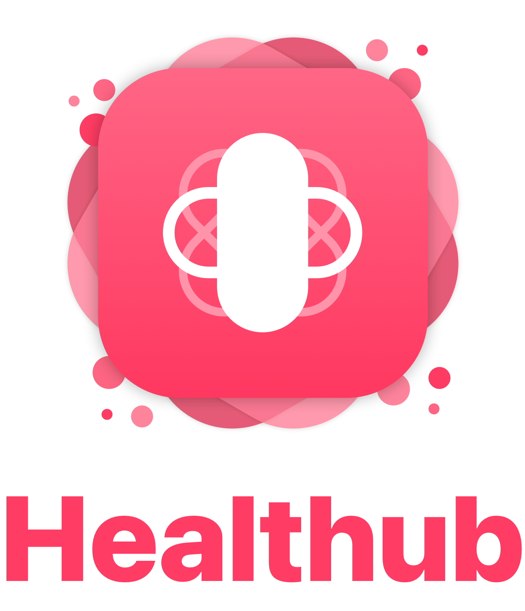

<!-- PROJECT LOGO -->
 

  

### Concept 💭
Healthub is an iOS application that offers some useful health-related functions such as managing therapies or booking a doctor's appointment 
Its main feature is the ability to detect drug interactions contained in therapies
> Healthub is a school project and has solely demonstrative purposes

